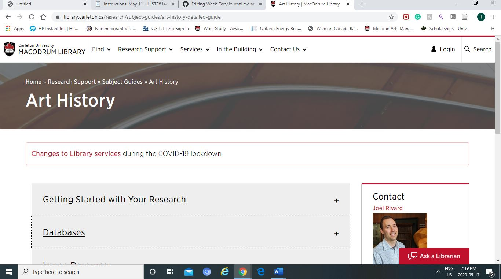

Who pays for the work to end up online?

-	For research, I would assume that they are funded by organizations to study certain issues like the Transcribe Bentham Project. The people that does the work would mostly be researchers. So the most of the cost would be allocated to their professional salaries. Then it would mostly be spent on the tools needed for doing that particular study. A significant investments will be allocated to make sure the research can maintain high quality. In the case of Transcribe Bentham, most of the manpower was volunteers so that did not cost as much money. 

Who does the work?

- As for who pays for the research to end up online, I believe it varies depending on the type of research. As for the Transcribe Bentham Project it was funded by the grant awarded by the Arts and Humanities ResearchCouncil. 

The ethical dimensions related to doing this work

-	The ethical dimensions of doing is work is total accessibility. If the organization that is funding the project has a lot volunteers and they allow anyone to join. This could result in lot of human errors. I'm sure they have editors but that is a lot of work when they have to basically go through every single one of them... to make sure that it is correct. The question of how many of them know the backround of what they are transcribing. I believe it is necessary to know so that the transciptions will make sense.

- There was a blog post @http://thenhier.ca/en/content/blog-contest-ethical-dimension.html regarding the topic that I found helpful

The resources offered by Carleton

-	I think most academic papers that I would require are online in the Carleton portals. But, last semester, I realized that Carleton had a lot of archival resources that I was not aware of… as students we were allowed to go in their rooms to see it in person if we ever required them for research. This also presents a barrier because not all theses materials are accessible online. As a student, I would fit into it as one of their targeted customers. Most of these research papers require interest in the topic itself... I think Carleton is doing a great job at separating databases based on the program that the students are taking. This makes the research even more easier compared to when I had just started University. 
