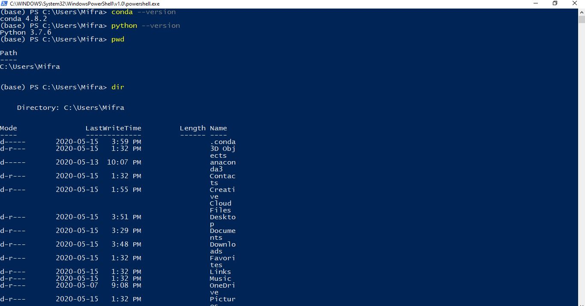
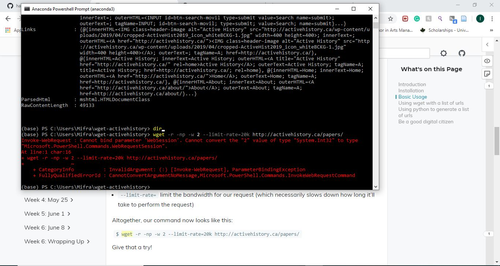

Anaconda
- Anaconda was really slow in setting up. That was understandable as it's an application.
-	I tried the command with and without $ sign and it was not working
- After I dowloaded it, when I tried opening it, the screen would turn black and it takes a couple of tries for it to open the anaconda navigator... I'm not sure if it an issue with my laptop or it's not normal
- I wrote the wrong commands ($ echo, $ conda --version and $ python --version) at first because I when I first tried it, I forget to not include the dollar sign
- then I wrote the correct command and it worked fine so then I knew that anaconda was properly installed
- then when I was trying out the navigating commands, it was not working when I wrote the command (cd documents, cd subfolder and cd..)
and I even tried it with the dollar sign
- then I took a day off and when back to try again
- it worked fine this time and I believe the issues was not using the names of the files in the directory 

Wget

-	Downloaded the application but cant open it so I kept dowloading it and by the end of that day I had about 3 versions of them dowloaded to my laptop. I could see it when I checked but I could't open. I freaked out and did not know what I was doing wrond so I also took a break that day and decided to start the day after.
-	Looking at youtube video @ https://www.youtube.com/watch?v=CkpTEJH6xkg&t=24s . 
- the video did not help much for solving my issue as I could not find it in the first place.
- Then I went to discord and saw that Nadia had the same problem and followed along the instruction by the prof
- unfortunetely, it did not work when I wrote the command wget.exe nor simply wget...
- Hence, after trying for the whole day while taking breaks here and there... it was still not helping
- So I decided to ask for help on discord and thankfully my peers William, Matthew and tony helped me by navigating through potential errors that I could have made  
- Finally, Matthew noticed that what I dowloaded in my c:\ windows was a shorcut version of wget
- I deleted that and used the wget application
- again, there was an issue and I noticed it's because there are other versions of wget and this one was only the third so I deleted every version except the original one
- It worked after that and I had no other issues after

API 

-	Got an error when I opened it in the anacondapowershell
-	Because I put the whole code in one file in the sublime text
-	Then I tried making separate files but they wouldn’t save together
- After I fixed the issue with wget, I made sure to check where my file was and again it was an issue with the correct location in the computer files and as I fixed it.  

OCR

-	Had a hard time finding the image downloaded. Again, I try to do all these applications on the same day to see if I could get any of them right. I think that was a bad idea because I got stuck in similar issues...
-	Then trying to open it in R studio
-	The commands were not working at first. I had an issue with trying to add the file into the R studio due to the way I saved the image as even in the corner with the value section, I had an extra line with the line that said "text"...
-After I fixed the mistake with the image location, everthing else was fine after I redid the process.

