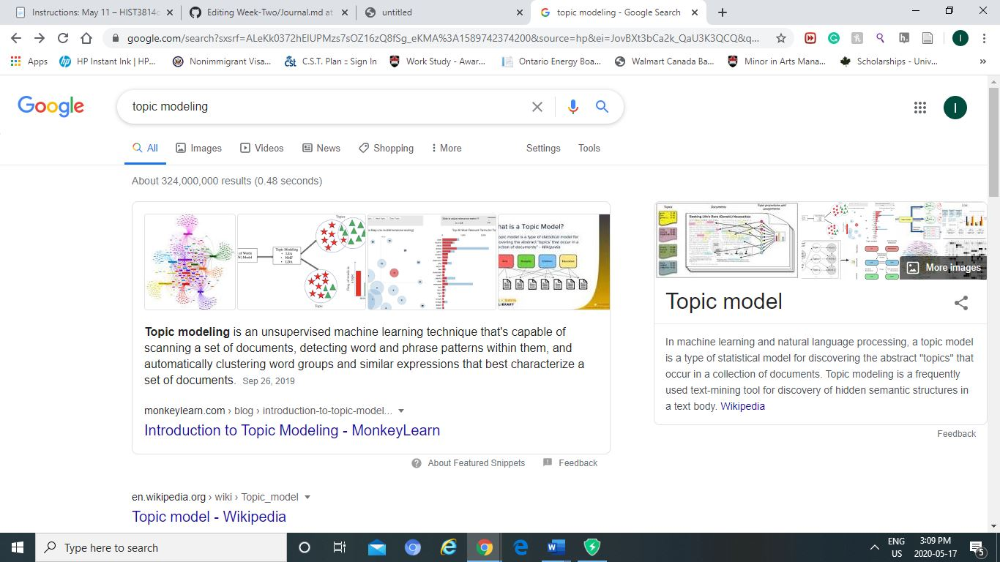
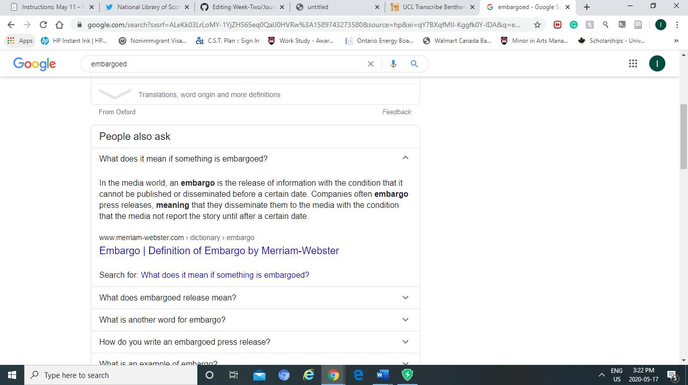
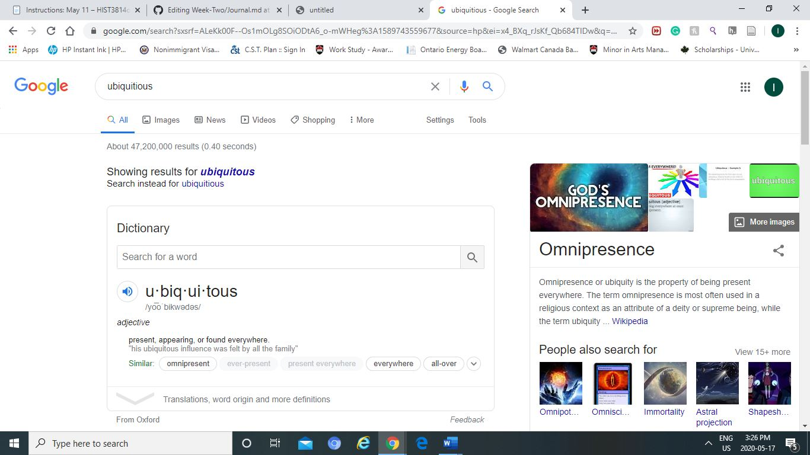

Recording 

-	Part of archeological project in Italy (reevaluating and putting it into database)
-	Lot of work but most work done by women
-	Final project does not show everything 
-	Labor hidden = something to be changed 
-	It is bad history when you hide 

Reading 1: Topic modeling Martha Ballard’s diary by Cameron Blevins 

Terms: 

Topic modeling = It is a database that is capable of scanning archival materials and detecting their writing patters to cluster them into categories. 

-	“exhaustive diary” describes the record. It is so hard to read and understand unless your proficient in cursive…. I tried reading a bit and only the numbers were barely recognisable.
-	 I find this a current problem that I have constantly encountered during research. I would type the most recognized terms but that would limit the papers that are using different terms in relation to the topic. 
-	The words in her diary had a lot of mistakes but they still categorized into their respective group, so I wonder how it is recognized…. It is really remarkable.   
-	Mallet a tool to track topics across text, and group them together with words that have similar meaning 
-	The thematic trends are also modeled after the words and can be seen across a period of time(changes).
-	Housework is a frequent topic. Over time the housework for a grandmother should decrease but the graph shows it increasing., which seems counter0intuitive. I can relate this part because I remember my grandma used to take her of me and my cousins most of the time when our parents were all at work. I saw her cooking, cleaning, and babysitting. While in martha’s case, the increase in her tasks are brough by her children being married and moving out as well as financial burden due to her husband.
-	Everyday topics – tangible world – housework and weather
-	Emotion – abstract world – tracked over the course of the diary and it is something that would not be possible without technology. Increasing too due to trouble in her family life (husband and son)
-	Topic modeling offers an opportunity to interpret materials in a new way that is advantageous in extracting unseen patterns in word usage. 
-	Gardening … Beautifully depict her work schedule over the seasons 
-	My question regarding how the words with mistakes can be recognized was answered in the comment section by the author himself, “Stretched over 10,000 entries and 27 entries, different spellings tend to smooth out. Mallet overcomes that disadvantage provided the variances are somewhat consistent, it doesn’t care whether the word is “delivd” or “delivered,” all it knows is that particular string of characters tends to appear alongside “birth” words.” 
-	I also found that it can analyze text in other languages. That is pretty advanced, and I feel like it has the potential to do a lot of interesting things. 

Reading 2: Twitter thread

-	turning collection into data 
-	international – digital resources Scotland, uk, Ireland 

Reading 3: Transcribe Bentham Project 

-	‘Many hands make light work. Many hands together make merry work‘,  Jeremy Bentham. I really liked this quote. It was my first time reading it… I should read more.  
-	It is an initiative to transcribe Bentham’s unpublished manuscripts. Anyone could do it… open to the public ….

Reading 4: ”Making such bargain: Transcribe Bentham and the quality and cost-effectiveness of crowdsourced transcription’,/ by Causer, Tim, Grint, Kris, Sichani, Anna-Maria and Terras, Melissa.

Terms 

Embargoed = It is when information can only be published after a certain date. 
Crowdsourcing = When a large number of people are tasked to obtain information 

-	questions if the volunteer’s contribution are of use in creation a scholarly database and if the launching is worth it in terms of finance
-	In the cultural heritage and research sectors there has been an increase in crowdsourcing.  I believe due to the advancement made by technology, especially the internet. 
-	The Mechanical Turk platform is a space for experimental economists and researcher’s conduction experiments
-	Ethics of paid crowdsourcing has been scrutinized because it is a low pay with no workers benefit while the Mechanical Turk platform has also been questioned in regard to generating academic research. 
-	Crowdsourcing is more about contribution rather than consumption…
-	The original grant for Transcribe Bentham ran out then UCL founded the rest. 
-	Then they got a 2-year grant from a foundation 
-	Most of the work were completed with the help of volunteers but there is a question of accuracy…
-	The project created a methodology based on the data collected during the funding period where they checked who did the transcription, how many mistakes they had, etc.
-	Based on the data they collected, the transcripts were mostly accurate with less than five errors, so I was really surprised about the high quality of the transcription by most volunteers considering their inexperience. It is remarkable how they improved their skills as they went along this project. 
-	The project volunteers were submitting high quality works, so they saved on costs there…

Reading 5: Humanities approaches to graphical display by Johanna Drucker 

Terms 

Ubiquitous = When someone’s influence can be seen everywhere 

-	This paper argues that humanities should be interpreted as capta rather than data as it would allow for more ambiguity and complexity.
-	Where capta is “taken” actively while data is “given” to be able to record and observe
-	The author claims that this uncertainty should be distinguished from using interpretations that come from being an observer-codependence.  
-	 The discipline of humanities should have its own tool rather than combining methods from other disciplines where the assumptions are completely at odds with humanistic method. This makes sense but it would hard to change the methodologies that are ingrained into the discipline.  
-	rethinking digital tools for visualization on basic principles of the humanities where humanities will be a concept of knowledge as interpretation and the world is seen through constructed and constitutive acts that does not represent pre-existing information. 
-	I did not know the concept of uncertainty introduced by Werner Heisenberg. I though the example of how a viewer gazing into a landscape may be more affected by the scene than the scene itself was really profound. How the observer and the phenomena are codependent to each rather…
-	Time in the humanities time is frequently understood and represented as discontinuous, multi-directional, and variable.
-	Likewise, spatiality is to be understood as space as a function of x (spatiality= space (x)).[4]
-	Author suggest that the subjective display of humanistic phenomena can be applied to at least four basic levels of interpretation or knowledge production.

  1.	Modelling phenomenological experience in the making of humanities 
  2.	Modeling relations among humanities documents i.e. discourse 
  3.	Modeling the representations of temporality and spatiality that are in humanities documents 
  4.	Modeling the interpretation of any of the above 

-	An interpretation has its own temporality and spatiality. It was really broad way of defining interpretation. 

Reading 6: Transcription maximized; expense minimized? Crowdsourcing and editing The Collected Works of Jeremy Bentham LLC 27.2 by Causer, Tonra and Wallace. 

-	it attempts to assess the potential benefits of engaging the public in humanities research.  
-	Jeremey Bentham was originator of contemporary notions of surveillance through his proposed panopticon prison. I remember reading his article in two of my classes. How he talked about designing the prison in a way that prisoners always will feel like they are being watched.
-	This edition will re-place the inadequate and incomplete eleven-volume edition published by Bentham’s literary executor, John Bowring.
-	However, before the launch of Transcribe Bentham in September 2010, an estimated 40,000 manuscripts were not transcribed. 
-	The   Bentham   Project   was   awarded   a   grant   of £262,673 from the Arts and Humanities Research Council. 
-	High-quality images of Bentham manuscripts were unavailable prior to the start   of   the   project, so   a   significant   investment was   made   in   photographing   and   digitizing   the material,  
-	Another substantial portion of the grant was allocated to the University of London Computer Centre for assembling and hosting and programming of the transcription tool.  Costs associated with research grants, and academic salaries but also including a portion of the professorial salary. 
-	Indeed, in order to avoid a sense of exploitation, a  crowdsourcing  venture  like Transcribe Bentham must  be  based  on  mutual  respect  and  trust ; in return, project staff must treat volunteers and  their  work  with  respect,  respond  to  enquiries promptly, keep them informed of project news and progress, and not waste their time
